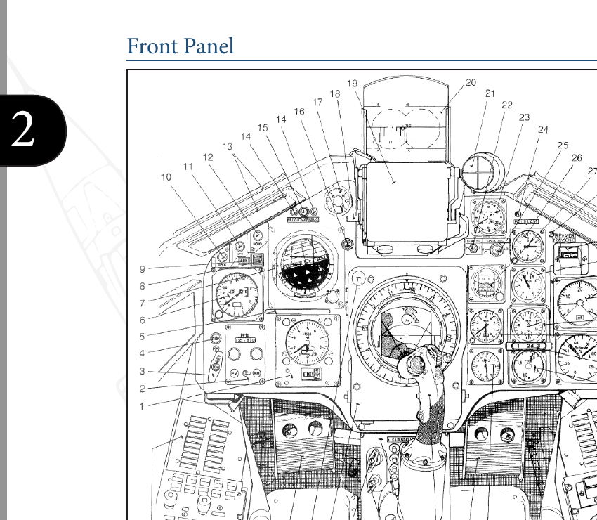

# AJS-37 Viggen (DCS) — Nybörjarmanual (Pedagogisk)

Det här är en praktisk steg-för-steg-guide för dig som är ny i flygsimulatorer och ny i Viggen.
Målet är att du snabbt ska kunna starta, taxa, lyfta, navigera enkelt och landa — utan att drunkna i teori.

Språk / Language / Idioma / Kieli:
🇬🇧 `beginner_manual.en.md` · 🇪🇸 `beginner_manual.es.md` · 🇸🇪 `beginner_manual.sv.md` · 🇫🇮 `beginner_manual.fi.md`

Officiell referens: `../DCS_AJS37_Flight_Manual_EN.pdf` (modulmanualen).

## 0) Vad Du Ska Kunna Efteråt

Du lär dig, i ordning:

1. Känna igen cockpitens områden och vilka instrument du måste hålla koll på.
2. Starta flygplanet, taxa och lyfta säkert.
3. Flyga en enkel navigering (läge `NAV`).
4. Landa stabilt och kontrollerat.

Vill du bara komma i luften snabbt: använd `quick_takeoff.md`.

## 1) Cockpiten Som Karta (Försök Inte Memorera Allt)

Börja med att lära dig *var* saker finns:

- **Frontpanelen**: primära flyginstrument + HUD + varningslampor.
- **Vänster sida**: många systemreglage (motor, el, m.m.).
- **Höger sida**: fler system och indikatorer.

Frontpanelöversikt:

### De 6 Viktigaste Sakerna Att Alltid Övervaka

1. **Fart** (km/h): tillräcklig för start / stigning / landning?
2. **Höjd** (m): stiger/sjunker du som tänkt?
3. **Attityd** (pitch/roll): är du stabil? roterar du för mycket?
4. **Motor**: RPM / EGT / EPR (dragkraft och temperaturer).
5. **Varningar**: master caution och varningslampor.
6. **HUD** (om du använder den): start-/flygsymbolik och flygbana.

## 2) Innan Du Börjar (Kontroller)

- Bind: pitch/roll/yaw, hjulbroms, gas (throttle), landställ, och trim.
- Har du inga pedaler: se till att roderaxeln (twist) är mjuk och centrerad.
- Hitta och kunna använda:
  - `Master Mode` (du använder `NAV` för normal flygning).
  - `SPAK` (stabilisering/autopilot) — valfritt men hjälpsamt.

## 3) Taxning (Första Fällan För Nybörjare)

Många krascher sker på marken.

- Viggen har relativt mycket dragkraft på tomgång: gör små gasändringar.
- Styr med pedaler; för snävare svängar behövs differentialbroms.
- Om du använder reverser på marken: se till att det är fritt bakom.

Mål: ta dig till banan lugnt och kontrollerat.

## 4) Start (Rekommenderad Nybörjarmetod)

Använd HUD-metoden från den officiella proceduren.

Innan du rullar:

- Rikta in dig på banan.
- Sätt `Master Mode` till `NAV` **minst 2 minuter** innan du ger startkraft.
- Landningsljus `LANDNING` ON.

Förenklad procedur:

1. Håll hjulbroms.
2. Max effekt **utan efterbrännkammare**.
3. Släpp broms och håll centerlinjen med pedaler.
4. Vid behov (kort bana/tung last): tänd EBK (afterburner).
5. Rotera enligt HUD-markeringar/cues.
6. När du är i luften: ställ in landställ upp.

Referens: `quick_takeoff.md` har full checklista och manualbilder.

## 5) Första Navigeringen (Håll Det Enkelt)

Viggen är byggd för planerad navigering. Som nybörjare:

- Flyg i `NAV`.
- Efter start: håll banriktning, stig stabilt, sväng sedan mot en tydlig visuell referens.
- Undvik “knappjakt” direkt efter lyft: flyg först, pilla sen.

Det här är “bra”:

- Stabil stigning.
- Stabil fart.
- Inga varningar.
- Mjuka svängar.

## 6) Landning (Snäll Trafikvarv)

Flyg ett stort, mjukt varv. Undvik att dyka mot banan.

Mål:

- Kom in stabilt och i linje.
- Fäll ut landstället i god tid.
- Håll säker AoA/fart.

Tips: träna touch-and-go i lugnt väder.

## 7) Vanliga Nybörjarmisstag (Och Åtgärder)

- **För aggressiv rotation** → Rotera mjukt; använd attitydreferenser.
- **“Jaga” HUD** → Flyg attityd + fart; HUD bekräftar, den styr inte.
- **Taxa för fort** → Tomgångsdrag är starkt; bromsa tidigt.
- **Glömmer `NAV`-timingen** → Sätt `NAV` minst 2 min innan startkraft.

## 8) Nästa Steg (Välj En Sak)

- Träning: 10 starter + 10 landningar (samma flygfält, inga vapen).
- Lägg till 1 färdighet: enkel rutt-navigering eller enkel vapenanvändning.
