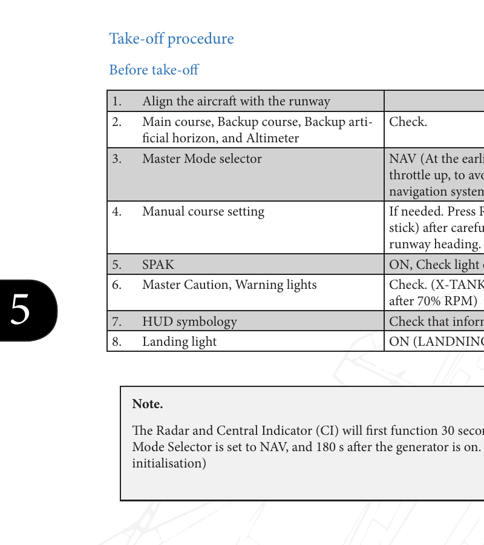
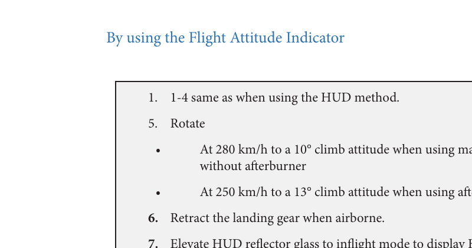

# AJS-37 Viggen — Quick Takeoff (DCS)

Language:
🇬🇧 [English](quick_takeoff.en.md) · 🇪🇸 [Español](quick_takeoff.es.md) · 🇸🇪 [Svenska](quick_takeoff.sv.md) · 🇫🇮 [Suomi](quick_takeoff.fi.md)

Based on the official manual: [docs/DCS_AJS37_Flight_Manual_EN.pdf](docs/DCS_AJS37_Flight_Manual_EN.pdf) (“Takeoff & Landing”).

## Step-by-step (cheat sheet)

1. Line up on the runway, hold wheel brakes.
2. `Master Mode`: `NAV` (set it at least 2 minutes before takeoff power).
3. (If needed) manual initial course: align with runway heading → press `Reference`.
4. `SPAK`: `ON` (confirm the light).
5. Landing light: `LANDNING` (ON).
6. Advance throttle to max power **without afterburner** (check EGT limits).
7. Release brakes, keep centerline with pedals.
8. If required, ignite afterburner (check zone/nozzle/EPR indications).
9. Rotate using the HUD time/distance line markers (or Method 2 speeds/attitudes).
10. Positive climb: gear up (note flaps retract with gear).
11. Continue climb until the FPV appears and the HUD switches to navigation symbology.
12. Raise the HUD glass to inflight mode if you need symbology at lower AoA.

### Keyboard shortcuts / bindings

DCS bindings are configurable and many module-specific controls can be unbound by default. Use this as a checklist of what to bind (plus a couple of common DCS defaults):

| Action | Keyboard | Notes |
| --- | --- | --- |
| Wheel brakes (hold) | `W` (common default) | Hold while applying power. |
| Landing gear toggle | `G` (common default) | Gear up once airborne. |
| `Master Mode` → `NAV` | (bind) | Critical: set 2 minutes before takeoff power. |
| `SPAK` ON/OFF | (bind) | Confirm ON before takeoff. |
| `Reference` (stick) | (bind) | Used for manual initial course setting. |
| HUD glass up/down | (bind) | Useful for manual course / low AoA symbology. |

## Before entering the runway (quick)

- Aircraft ready (engine running, generator ON, basic systems stable).
- Set the minimum you need for takeoff + navigation: `Master Mode` and HUD.

## On the runway (Before take-off)

1. Align the aircraft with the runway.
2. Check: main course, backup course, backup artificial horizon, and altimeter.
3. `Master Mode selector`: `NAV` (at least 2 minutes before takeoff power, to avoid nav issues).
4. Manual course setting (if needed): after carefully aligning with runway heading, press `Reference` (on the stick).
5. `SPAK`: `ON`, confirm the light is on.
6. Master Caution / Warning lights: check (the `X-TANK BRÄ` light typically disappears first after ~70% RPM).
7. HUD symbology: check it looks correct.
8. Landing light: `LANDNING` (ON).

Manual note: Radar and the Central Indicator (CI) will only function ~30 s after `Master Mode` is set to `NAV`, and ~180 s after the generator is on (software initialization).

### Manual initial course setting (only if you need it)

Useful if the runway is slippery and there are heavy crosswinds.

1. `Master Mode selector`: `NAV`.
2. Raise the HUD reflector glass to “inflight” (upper).
3. Carefully align with the runway heading.
4. Press `Reference` (on the stick).
5. Lower the HUD reflector glass to “takeoff/landing” (lower).

To reset an existing manual initial course setting: cycle `Master Mode` `NAV → BER → NAV` (also applies if you want to return to an automatic initial course setting).

## Method 1: takeoff using the HUD (recommended)

1. Apply wheel brakes.
2. Advance throttle to maximum power **without afterburner**.
   - Check EGT (max `590°C + outside ambient temperature`).
3. Release brakes, steer with pedals.
4. If needed, ignite afterburner.
   - Check:
     - Zone indicator = desired afterburner zone.
     - Exhaust nozzle indicator = desired zone achieved.
     - EPR (pressure ratio):
       - Zone 2: `< +15°C` → `> 1.9`
       - Zone 2: `> +15°C` → `> 1.8`
       - Zone 3: maximum power.
5. Check IAS and the time/distance line.
6. Rotate when the time/distance line reaches the markers.
   - Set the flight path vector (FPV) to:
     - No afterburner: on the horizon line.
     - With afterburner: about the height of the outer pillars (≈ `3°` above the horizon).
7. Confirm airspeed continues to increase.
8. Gear up when airborne.
   - Note: retracting the gear retracts the flaps; expect a slight reduction in lift.
9. Climb with the selected attitude until the FPV appears; the HUD should switch automatically from takeoff symbology to normal navigation.
10. Raise the HUD reflector glass to inflight mode to display HUD symbology at lower angles of attack.

## Method 2: takeoff using the Flight Attitude Indicator

1. Steps 1–4: same as the HUD method.
2. Rotate:
   - At `280 km/h`: to a `10°` climb attitude (max power without afterburner).
   - At `250 km/h`: to a `13°` climb attitude (with afterburner).
3. Gear up when airborne (same note about flaps/lift).
4. Raise the HUD reflector glass to inflight mode if you need HUD symbology at low AoA.

## Quick safety reminders

- Slippery runway + heavy crosswind: use manual initial course setting.
- If you feel a “dip” in lift when raising the gear: don’t fight it—stabilize attitude and speed.
